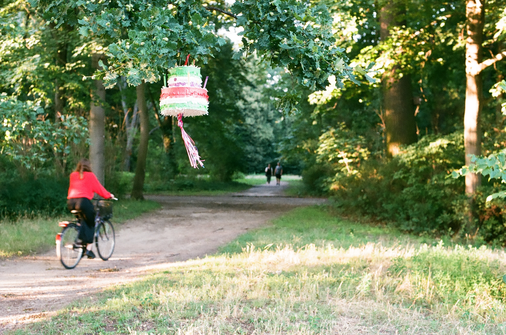
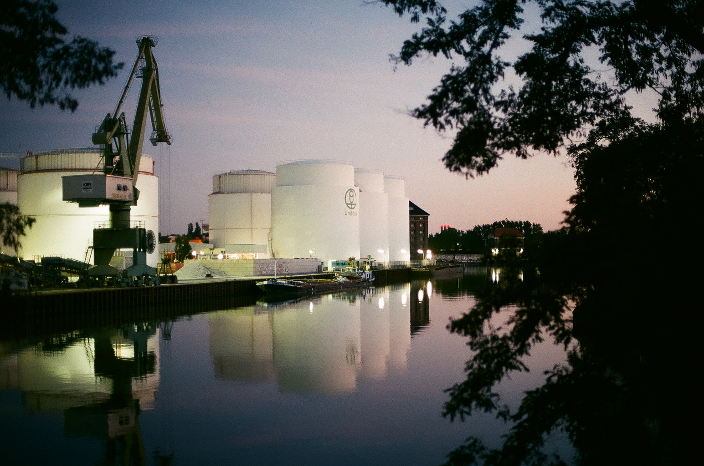

//event listener to make the imgs appear with a click; DONE
//than with the timeout on load; DONE
//than this loop will need to be made, so the imgs dont load infinitely; DONE

//transition so it slides smoothly;

click event on a dot & trigger pic with the same number;

<!-- https://wsvincent.com/javascript-closure-settimeout-for-loop/ -->
<!-- https://stackoverflow.com/questions/29483803/how-to-show-just-one-image-at-a-time-at-a-set-interval -->

<!-- 

 -->

1. why transitionend?
2. after click longer break?

<!-- for(var i=0; i<pictures.length; i++) {
    // pictures[i].setAttribute('id','dotNum' + i);
    pictures[i].addEventListener('click', function(e) {
        console.log(e.target);
        // console.log('2: '+ typeof e);
    });
} -->
